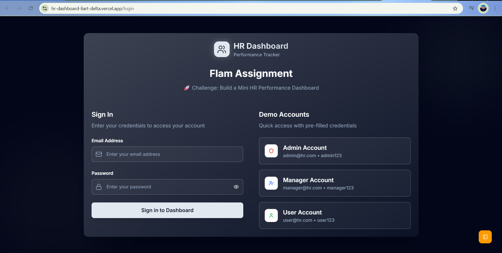
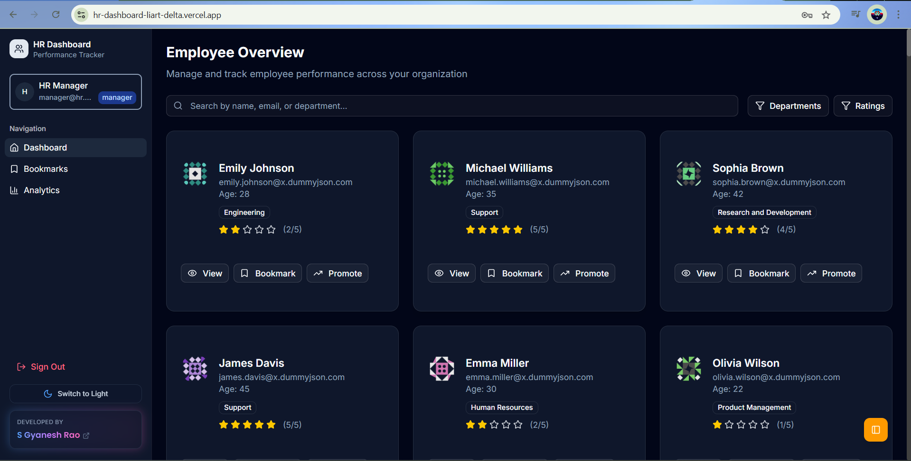
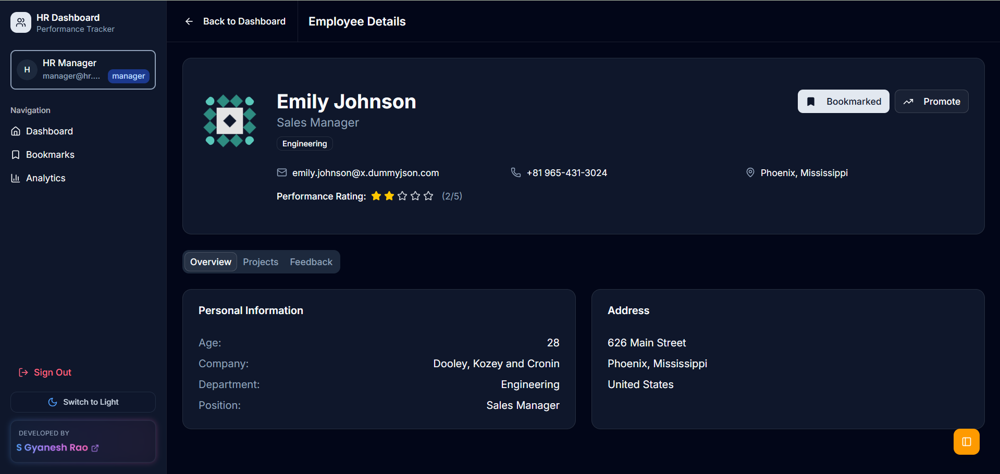
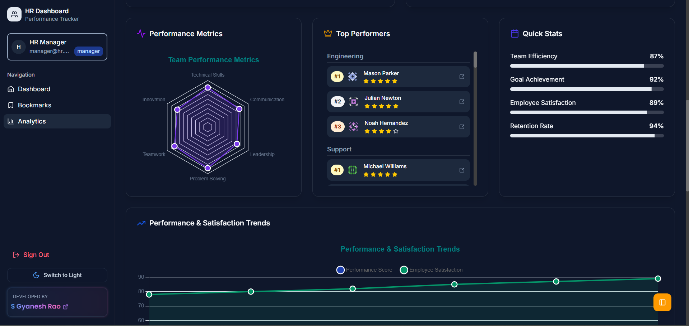

# HR Dashboard

A modern HR management dashboard built with Next.js, designed to streamline human resources operations and provide insightful analytics.

🚀 **Live Demo**: [https://hr-dashboard-liart-delta.vercel.app/](https://hr-dashboard-liart-delta.vercel.app/)

## 📋 Table of Contents

1. [Getting Started](#getting-started)
2. [Installation](#installation)
3. [Screenshots](#screenshots)
4. [Technologies Used](#technologies-used)
5. [Project Structure](#project-structure)

## 📸 Screenshots

### Login

*Main dashboard showing key HR metrics and analytics*

### Dashboard Overview

*Main dashboard showing key HR metrics and analytics*

### Employee Details

*Main dashboard showing key HR metrics and analytics*

### Bookmarks

*Employee list and profile management interface*

### Analytics & Reports
## View - 01

*Detailed analytics and reporting features*

## View - 02

*Detailed analytics and reporting features*

## View - 03

*Detailed analytics and reporting features*


## 🚀 Getting Started

This is a [Next.js](https://nextjs.org) project bootstrapped with [`create-next-app`](https://nextjs.org/docs/app/api-reference/cli/create-next-app).

### Prerequisites

Make sure you have the following installed on your system:
- Node.js (v18 or higher)
- npm, yarn, pnpm, or bun

## 📦 Installation

1. **Clone the repository**
   ```bash
   git clone https://github.com/Gyanesh-Rao28/HR-Dashboard.git HrDashboard
   ```

2. **Navigate to the project directory**
   ```bash
   cd HrDashboard
   ```

3. **Install dependencies**
   ```bash
   npm install
   # or
   yarn install
   # or
   pnpm install
   # or
   bun install
   ```

4. **Run the development server**
   ```bash
   npm run dev
   # or
   yarn dev
   # or
   pnpm dev
   # or
   bun dev
   ```

5. **Open your browser**
   
   Navigate to [http://localhost:3000](http://localhost:3000) to see the application running.

## 🛠️ Technologies Used

- **Framework**: [Next.js](https://nextjs.org/) - React framework for production
- **Language**: TypeScript/JavaScript
- **Styling**: CSS/Tailwind CSS (specify your actual styling solution)
- **Font**: Geist font family
- **Deployment**: [Vercel Platform](https://vercel.com/)

## 📁 Project Structure

```
HrDashboard/
├── app/                 # Next.js app directory
├── components/          # Reusable components
├── public/             # Static assets
├── screenshots/        # Project screenshots
└── README.md          # Project documentation
```